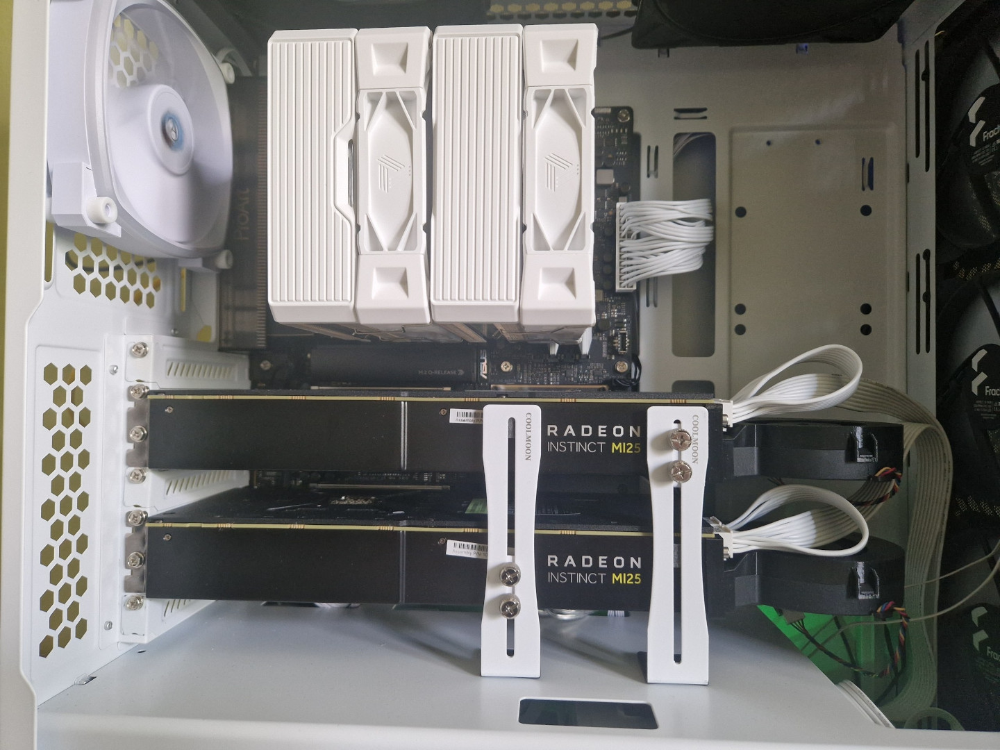

# AMD Radeon Instinct MI25/WX9100 16GB HBM2



**PC HW**
```text
       _,met$$$$$gg.             root@DoraAI 
    ,g$$$$$$$$$$$$$$$P.          ----------- 
  ,g$$P"        """Y$$.".        OS: Debian GNU/Linux forky/sid (forky) x86_64 
 ,$$P'              `$$$.        Kernel: 6.19.11+deb14-amd64 
',$$P       ,ggs.     `$$b:      Uptime: 1 hour, 17 mins 
`d$$'     ,$P"'   .    $$$       Packages: 74 (pip), 2675 (dpkg) 
 $$P      d$'     ,    $$P       Shell: zsh 5.9 
 $$:      $$.   -    ,d$$'       Editor: vim.basic 
 $$;      Y$b._   _,d$P'         Resolution: 1920x1080 
 Y$$.    `.`"Y$$$$P"'            Terminal: /dev/pts/5 
 `$$b      "-.__                 CPU: AMD Ryzen 7 9700X (16) @ 5.5GHz 
  `Y$$                           GPU: AMD ATI Radeon PRO WX 9100 
   `Y$$.                         GPU: AMD ATI Radeon PRO WX 9100 
     `$$b.                       GPU: AMD ATI Radeon Graphics 
       `Y$$b.                    Memory: 8.92 GiB / 30.00 GiB (29%) 
          `"Y$b._                Network: 1 Gbps 
              `"""               BIOS: American Megatrends Inc. 20.4 (01/28/2026)
```

**BIOS**
- Filename: `AMD.WX9100.16384.180922.rom`
- VBIOS Version: `016.001.001.000.011124`

Specification:
- GPU Name: Vega 10
- Process Size: 14 nm
- FP16 (half): 24.58 TFLOPS (2:1) 
- FP32 (float): 12.29 TFLOPS
- GPU Clock: 1500 MHz
- Memory Clock: 945 MHz
- Memory Size: 16 GB 
- Memory Type: HBM2
- Memory Bus: 2048 bit 
- Bandwidth: 436.2 GB/s 

## LM Studio

- API: Vulkan API
- System prompt:
    ```
    You are a helpful, knowledgeable AI assistant.
    Answer questions concisely and factually.
    Always cite sources when available.
    Use retrieved documents if necessary.
    
    Always respond in the same language as the user's latest message.
    Do not change the response language unless the user explicitly asks to.
    ```
- Temperature: `0`
- Asked question:
    ```
    I need an Arduino sketch for Arduino UNO.
    It is required to measure temperature and, using PWM, change the voltage so that a fan connected to the PWM pin changes its speed.
    The fan is a 4-pin computer fan.
    The pin responsible for speed control accepts 0–5 V.
    The sensor is an NTC 10K 3435.
    The sensor voltage, temperature, and the desired PWM percentage must be displayed in Serial for debugging.
    In case of overheating, or if the sensor is open-circuit or short-circuited, the fan speed must be set to maximum.
    During controller initialization, perform a visual test:
    - increase speed to 100% for 2 seconds
    - decrease to 20% for 2 seconds
    - increase speed to 100% for 2 seconds
    - decrease to 20% for 2 seconds
    - then switch to the main temperature-based fan control loop
    ```
- Offload: 100% GPU (no CPU layers)

> Sometimes, LM Studio may quietly keep some layers on CPU by default, which significantly reduces inference performance.

### SINGLE GPU
| MODEL            | Quant | KV Quant       | Unified KV cache  | Context size | VRAM used | Token generation | Notes         | LM Studio version / Vulkan llama.cpp (Linux) / Mesa / Kernel |
|------------------|-------|----------------|-------------------|--------------|-----------|------------------|---------------|--------------------------------------------------------------|
| GPT-OSS:20B      | MXFP4 | default (fp16) | enabled (default) | 4096         | <16 GiB   | 79 tok/sec       | Low reasoning | 0.4.12 / v2.13.0 / Mesa 26.0.4-1 / 6.19.11+deb14-amd64       |


### DUAL GPU
- Split mode: layer
- Tensor split: 1,1 (50/50)

| MODEL               | Quant  | KV Quant       | Unified KV cache  | Context size | VRAM used | Token generation | Notes            | LM Studio version / Vulkan llama.cpp (Linux) / Mesa / Kernel |
|---------------------|--------|----------------|-------------------|--------------|-----------|------------------|------------------|--------------------------------------------------------------|
| GPT-OSS:20B         | MXFP4  | default (fp16) | enabled (default) | 4096         | <16 GiB   | 29 tok/sec       | Low reasoning    | 0.4.12 / v2.13.0 / Mesa 26.0.4-1 / 6.19.11+deb14-amd64       |
| Gemma4:26B-A4B      | Q4_K_M | default (fp16) | enabled (default) | 4096         | ~18.6 GiB | 25 tok/sec       | Thinking enabled | 0.4.12 / v2.13.0 / Mesa 26.0.4-1 / 6.19.11+deb14-amd64       |
| Gemma4:26B-A4B      | Q6_K   | default (fp16) | enabled (default) | 4096         | ~24 GiB   | 22 tok/sec       | Thinking enabled | 0.4.12 / v2.13.0 / Mesa 26.0.4-1 / 6.19.11+deb14-amd64       |
| Gemma4:31B          | Q4_K_M | default (fp16) | enabled (default) | 4096         | ~23 GiB   | 9.5 tok/sec      | Thinking enabled | 0.4.12 / v2.13.0 / Mesa 26.0.4-1 / 6.19.11+deb14-amd64       |
| Gemma4:31B          | Q6_K   | default (fp16) | enabled (default) | 4096         | ~29.1 GiB | 7.8 tok/sec      | Thinking enabled | 0.4.12 / v2.13.0 / Mesa 26.0.4-1 / 6.19.11+deb14-amd64       |
| Qwen3-Coder:30B-A3B | Q4_K_M | default (fp16) | enabled (default) | 4096         | ~18.1 GiB | 30 tok/sec       |                  | 0.4.12 / v2.13.0 / Mesa 26.0.4-1 / 6.19.11+deb14-amd64       |
| Qwen3-Coder:30B-A3B | Q6_K   | default (fp16) | enabled (default) | 4096         | ~24 GiB   | 27 tok/sec       |                  | 0.4.12 / v2.13.0 / Mesa 26.0.4-1 / 6.19.11+deb14-amd64       |

> VRAM usage depends on:
> - Model quantization
> - KV (cache) quantization
> - Unified KV cache option (significantly reduce VRAM usage)
> - Context size

## Docker: llama.cpp

TBD
